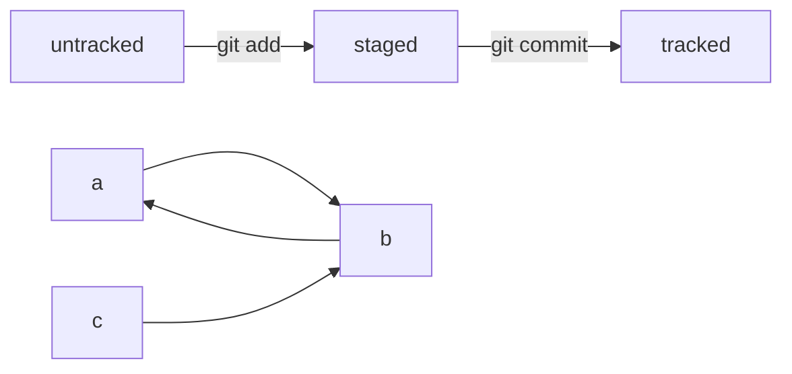

# Hello, World!

 

This git is empty

```mermaid

graph LR;
    untracked -- "git add" --> staged;
    staged -- "git commit" --> tracked;

%% example comment
a --> b
c --> b
b --> a

```

add 2 branch

